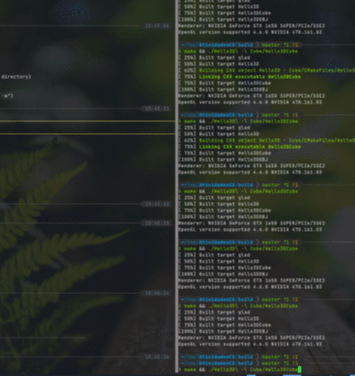

## Tarefa M1:

Diretório: [Hello3D](Hello3D)

## Tarefa M2:

Diretório: [Hello3D - Cube](./Hello3D%20-%20Cube)
 

## Tarefa M2 (Atividade Vivencial 1):

Vizualizador 3D

Diretório: [Hello3D - OBJ](./Hello3D%20-%20OBJ)
 

## Tarefa M3:

Leitura de OBJ com texture.

Diretório: [Hello3D - OBJ - Texture](./Hello3D%20-%20OBJ%20-%20Texture)
 

## Tarefa M4:

Iluminação

OBS: Nessa atividade fiz o código differente... Criei um header e source (sgl.hpp, sgl.cpp) (Simple Graphics Library) que contém o código opengl + códigos para criação dos objetos
(como uma "biblioteca" para abstrair a parte gráfica) (utilizei um pouco do meu código de PG para criar as funções e classes da biblioteca!), e o main.cpp contém apenas a criação da cena...

Diretório: [NewHello3D - Lighting](./NewHello3D%20-%20Lighting)
 

